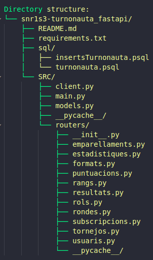

# TurnoNauta_FastAPI


**Altres Repositoris del Projecte**    
- [MOBIL](https://github.com/Snr1s3/Turnonauta.git)
- [Server APP](https://github.com/Snr1s3/serverApp_Turnonauta.git)
- [WEB](https://github.com/EdwindanielTIC/web_TurnoNauta.git)  
- [Presentacio](https://docs.google.com/presentation/d/1K03l9CcSwC65fDLJo3RcBxfwdepAkTG-f7iyhe_hQaQ/edit?usp=sharing)
- [Memoria](https://docs.google.com/document/d/1RH_1SOikwa-qEJ7z6mxCnpTQ9W4fVT4ch-nEfXnbZEM/edit?usp=sharing)


## Iniciar l'APIREST
```bash
source ~/venv/bin/activate

sudo ~/venv/bin/uvicorn TurnoNauta_FastAPI.SRC.main:app \
    --reload \
    --host 0.0.0.0 \
    --port 8443 \
    --ssl-keyfile  RUTA A LA CLAU PRIVADA
     \
    --ssl-certfile RUTA AL CERTIFICAT
```
## Estructura de Directoris


## requirements.txt

Aquest fitxer conté les dependències necessàries per executar el projecte. Les llibreries incloses són:

- **`fastapi`**: Framework web modern i ràpid per construir APIs amb Python, basat en estàndards com OpenAPI i JSON Schema.
- **`uvicorn`**: Servidor ASGI lleuger i ràpid per executar aplicacions FastAPI.
- **`psycopg2-binary`**: Driver per connectar-se a bases de dades PostgreSQL des de Python.
- **`pydantic`**: Llibreria per a la validació de dades i la creació de models basats en tipus.

### Instal·lació

Per instal·lar totes les dependències, executa:

```bash
pip install -r requirements.txt
```


## sql/

Aquest directori conte el fitxer de creació de la base de dades i un parell d'inserts.

- **`turnonauta.psql`**: Creació de la base de dades.
- **`insertsTurnonauta.psql`**: Creació de dades a la base de dades.


## SRC/client.py

Aquest fitxer gestiona la connexió amb la base de dades PostgreSQL utilitzant un pool de connexions. També inclou funcionalitats per reiniciar les seqüències de les taules de la base de dades.

### Funcionalitats principals

- **Configuració de la connexió a PostgreSQL**:
  - Es defineix un diccionari `db_config` amb els paràmetres de connexió:
    - `host`: Adreça IP del servidor de la base de dades (`172.17.0.2`).
    - `user`: Nom d'usuari (`turnonauta`).
    - `password`: Contrasenya (`pirineus`).
    - `database`: Nom de la base de dades (`turnonauta`).
    - `port`: Port de connexió (`5432`).

- **Pool de connexions**:
  - Es crea un pool de connexions amb `psycopg2.pool.SimpleConnectionPool`, que permet gestionar entre 1 i 30 connexions simultànies.

- **Reinici de seqüències**:
  - La funció `get_db_connection()` reinicia les seqüències de les taules de la base de dades per assegurar que els identificadors autoincrementals comencin des del valor correcte.
  - Les seqüències es reinicien utilitzant comandes SQL com:
    ```sql
    SELECT setval('emparallaments_id_emperallent_seq', COALESCE((SELECT MAX(id_emperallent) FROM public.emparallaments), 0) + 1, false);
    ```

- **Gestió de connexions**:
  - **`get_db_connection()`**: Obté una connexió del pool i reinicia les seqüències.
  - **`release_db_connection(conn)`**: Retorna una connexió al pool després d'usar-la.


## SRC/main.py

Aquest fitxer és el punt d'entrada principal de l'aplicació FastAPI. Defineix les rutes de l'API, la configuració del servidor i la integració amb altres components del projecte.

### Funcionalitats principals

- **Configuració del servidor**:
  - Utilitza `FastAPI` per crear l'aplicació.
  - Inclou el middleware `CORSMiddleware` per permetre peticions des de qualsevol origen (`allow_origins=["*"]`).

- **Rutes de l'API**:
  - Les rutes estan organitzades per funcionalitats, com ara puntuacions, rondes, usuaris, tornejos, etc.
  - Cada ruta està associada a una funció que interactua amb la base de dades o altres components del sistema.

- **Integració amb altres mòduls**:
  - Importa models, esquemes i funcions de les carpetes `models`, `schemas` i `routers`.
  - Utilitza funcions del fitxer `client.py` per gestionar connexions a la base de dades.

### Rutes principals

#### **Puntuacions**
- **`GET /puntuacions/`**: Obté totes les puntuacions.
- **`GET /puntuacions/get_by_tournament/{torneig_id}`**: Obté les puntuacions d'un torneig per ID.
- **`POST /puntuacions/add`**: Afegeix una nova puntuació.
- **`DELETE /puntuacions/delete_puntuacions_tournament/{torneig_id}`**: Elimina les puntuacions d'un torneig.

#### **Rondes**
- **`GET /rondes/`**: Obté totes les rondes.
- **`POST /rondes/add`**: Afegeix una nova ronda.
- **`PUT /rondes/update_ronda`**: Actualitza una ronda.

#### **Usuaris**
- **`GET /users/`**: Obté tots els usuaris.
- **`POST /users/add_user`**: Afegeix un nou usuari.
- **`PUT /users/update_name/{user_id}`**: Actualitza el nom d'un usuari.
- **`DELETE /users/delete_by_id/{user_id}`**: Elimina un usuari per ID.

#### **Tornejos**
- **`GET /tornejos/`**: Obté tots els tornejos.
- **`POST /tournaments/create`**: Crea un nou torneig.
- **`GET /tournaments/active`**: Obté els tornejos actius.
- **`GET /tournaments/ended`**: Obté els tornejos finalitzats.

#### **Altres funcionalitats**
- **`GET /docs`**: Endpoint per accedir a la documentació de l'API.
- **`GET /formats/`**: Obté tots els formats disponibles.
- **`GET /rangs/`**: Obté tots els rangs disponibles.
- **`GET /resultats/`**: Obté tots els resultats disponibles.

## SRC/models.py

Aquest fitxer defineix els models de dades utilitzats per l'aplicació. Els models estan basats en `Pydantic` i representen les entitats principals del sistema, com ara usuaris, tornejos, puntuacions, rondes, etc. Aquests models s'utilitzen per validar i estructurar les dades que es processen a través de l'API.

### Models principals

#### **Emparellaments**
- **`Emparellaments`**: Representa un emparellament entre dos jugadors en una ronda.
  - Atributs: `id_emperallent`, `id_ronda`, `id_usuari1`, `resultat_usuari_1`, `id_usuari2`, `resultat_usuari_2`, `id_usuari_guanyador`, `id_usuari_perdedor`.
- **`EmparellamentNom`**: Extensió d'`Emparellaments` que inclou els noms dels jugadors (`nom_usuari1`, `nom_usuari2`).

#### **Estadístiques**
- **`Estadistiques`**: Conté estadístiques d'un usuari.
  - Atributs: `id_estats`, `id_usuari`, `partides_jugades`, `partides_guanyades`, `tornejos_jugats`, `tornejos_guanyats`.

#### **Format**
- **`Format`**: Representa el format d'un torneig.
  - Atributs: `id_format`, `nom`, `joc`, `jugadors`, `temps`, `regles`.

#### **Puntuacions**
- **`Puntuacio`**: Representa la puntuació d'un jugador en un torneig.
  - Atributs: `id_torneig`, `id_usuari`, `sos`, `victories`, `empat`, `derrotes`, `punts`.
- **`PuntuacioName`**: Extensió de `Puntuacio` que inclou el nom del jugador (`nom`).

#### **Rangs**
- **`Rang`**: Representa un rang dins del sistema.
  - Atributs: `id_rang`, `nom`, `descripcio`.

#### **Resultats**
- **`Resultat`**: Representa el resultat d'una ronda.
  - Atributs: `id_resultat`, `id_ronda`, `id_usuari_guanyador`.

#### **Rols**
- **`Rol`**: Representa un rol dins del sistema.
  - Atributs: `id_rol`, `nom`, `permet_torneig`.

#### **Rondes**
- **`Ronda`**: Representa una ronda d'un torneig.
  - Atributs: `id_ronda`, `id_torneig`, `estat`.

#### **Subscripcions**
- **`Subscripcio`**: Representa una subscripció d'un usuari.
  - Atributs: `id_subscripcio`, `id_usuari`, `data_inici`, `data_final`, `tipus`, `estat`.

#### **Tornejos**
- **`Torneig`**: Representa un torneig.
  - Atributs: `id_torneig`, `nom`, `joc`, `usuari_organitzador`, `competitiu`, `virtual`, `format`, `premi`, `num_jugadors`, `data_d_inici`, `data_final`.
- **`NewTorneig`**: Model per crear un nou torneig.

#### **Usuaris**
- **`Usuaris`**: Representa un usuari del sistema.
  - Atributs: `id_usuaris`, `rol`, `username`, `email`, `bio`, `telefono`, `contrasenya`, `rang`, `data_de_registre`.
- **`UserStatistics`**: Estadístiques d'un usuari.
  - Atributs: `id`, `username`, `rounds_played`, `rounds_won`, `tournaments_played`, `tournaments_won`.
- **`UserWithPoints`**: Usuari amb punts.
  - Atributs: `username`, `punts`.
- **`NewUser`**: Model per crear un nou usuari.
- **`UpdateNameRequest`**: Model per actualitzar el nom d'un usuari.

#### **Altres models**
- **`NewPuntuacio`**: Model per afegir una nova puntuació.
- **`NewRonda`**: Model per afegir una nova ronda.
- **`UpdateRondaRequest`**: Model per actualitzar una ronda.
- **`PasswordUpdateRequest`**: Model per actualitzar la contrasenya d'un usuari.

## SRC/routers/

El directori `SRC/routers/` conté els mòduls que defineixen les rutes específiques de l'API per gestionar diferents entitats del sistema, com ara usuaris, tornejos, puntuacions, rondes, etc. Cada fitxer dins d'aquest directori està dedicat a una funcionalitat o entitat específica, seguint el principi de modularitat.

### Estructura i funcionalitats

- **`emparellaments.py`**  
  Gestiona les rutes relacionades amb els emparellaments entre jugadors en una ronda.  
  **Rutes principals**:
  - `GET /emparellaments/`: Obté tots els emparellaments.
  - `POST /emparellaments/add`: Afegeix un nou emparellament.

- **`estadistiques.py`**  
  Gestiona les estadístiques dels jugadors.  
  **Rutes principals**:
  - `GET /estadistiques/`: Obté les estadístiques de tots els jugadors.
  - `GET /estadistiques/{id_usuari}`: Obté les estadístiques d'un jugador específic.

- **`formats.py`**  
  Gestiona els formats dels tornejos.  
  **Rutes principals**:
  - `GET /formats/`: Obté tots els formats disponibles.
  - `POST /formats/add`: Afegeix un nou format.

- **`puntuacions.py`**  
  Gestiona les puntuacions dels jugadors en els tornejos.  
  **Rutes principals**:
  - `GET /puntuacions/`: Obté totes les puntuacions.
  - `POST /puntuacions/add`: Afegeix una nova puntuació.
  - `DELETE /puntuacions/delete_puntuacions_tournament/{torneig_id}`: Elimina les puntuacions d'un torneig.

- **`rangs.py`**  
  Gestiona els rangs dels jugadors.  
  **Rutes principals**:
  - `GET /rangs/`: Obté tots els rangs disponibles.
  - `POST /rangs/add`: Afegeix un nou rang.

- **`resultats.py`**  
  Gestiona els resultats de les rondes.  
  **Rutes principals**:
  - `GET /resultats/`: Obté tots els resultats.
  - `POST /resultats/add`: Afegeix un nou resultat.

- **`rols.py`**  
  Gestiona els rols dels usuaris.  
  **Rutes principals**:
  - `GET /rols/`: Obté tots els rols disponibles.
  - `POST /rols/add`: Afegeix un nou rol.

- **`rondes.py`**  
  Gestiona les rondes dels tornejos.  
  **Rutes principals**:
  - `GET /rondes/`: Obté totes les rondes.
  - `POST /rondes/add`: Afegeix una nova ronda.
  - `PUT /rondes/update_ronda`: Actualitza una ronda.

- **`subscripcions.py`**  
  Gestiona les subscripcions dels usuaris.  
  **Rutes principals**:
  - `GET /subscripcions/`: Obté totes les subscripcions.
  - `POST /subscripcions/add`: Afegeix una nova subscripció.

- **`tornejos.py`**  
  Gestiona els tornejos.  
  **Rutes principals**:
  - `GET /tornejos/`: Obté tots els tornejos.
  - `POST /tornejos/create`: Crea un nou torneig.
  - `GET /tornejos/active`: Obté els tornejos actius.

- **`usuaris.py`**  
  Gestiona els usuaris del sistema.  
  **Rutes principals**:
  - `GET /users/`: Obté tots els usuaris.
  - `POST /users/add_user`: Afegeix un nou usuari.
  - `PUT /users/update_name/{user_id}`: Actualitza el nom d'un usuari.
  - `DELETE /users/delete_by_id/{user_id}`: Elimina un usuari per ID.
